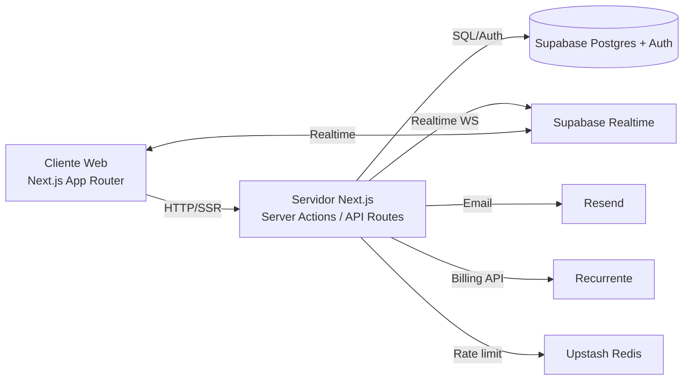
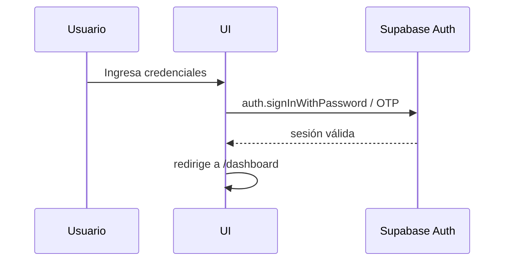
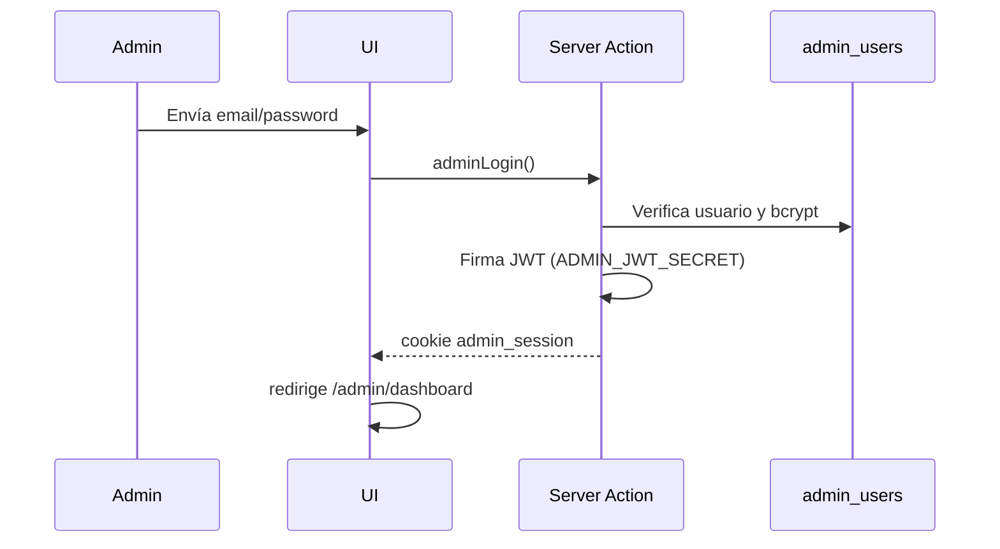
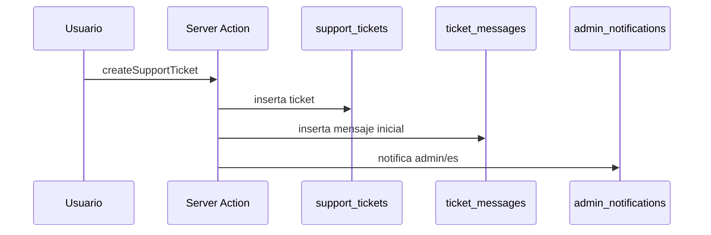
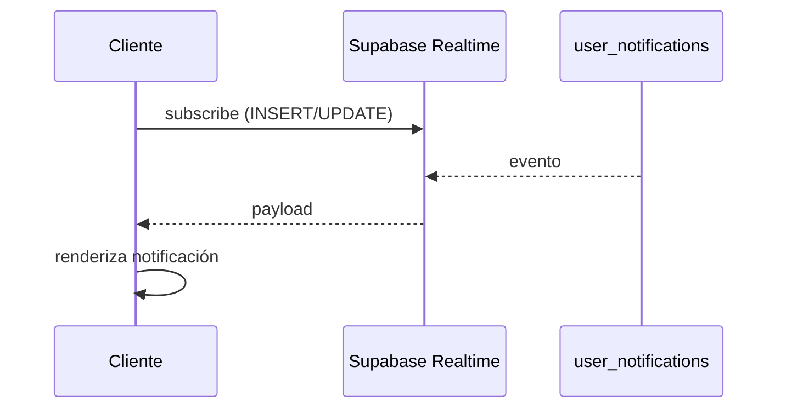
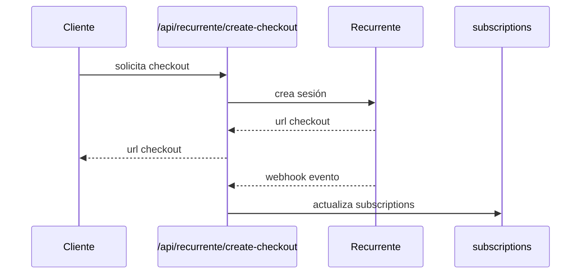

# Documentación técnica de RutaCero

## 1. Resumen
RutaCero es una aplicación web para salud financiera y control de deudas. Está construida con Next.js (App Router) y Supabase. Incluye flujos para usuarios finales (registro, onboarding, deudas, pagos, presupuestos, forecast y notificaciones) y un panel administrativo completo con RBAC, soporte, auditoría y reportes.

## 2. Alcance y multitenencia
- Arquitectura multi-tenant lógica sobre un solo Postgres (Supabase local) y esquema `public`.
- Tenant activo por workspace seleccionado (`user_profiles.current_tenant_id`).
- Aislamiento por tenant + usuario mediante RLS y filtros server-side (`tenant_id` + `user_id`).
- Billing por tenant en `subscriptions` (un plan por workspace/tenant).
- La data personal no se comparte entre tenants ni entre usuarios.

## 3. Stack tecnológico

### 3.1 Frontend
- Next.js 16.1.1 (App Router, Server Components, Server Actions)
- React 19
- TypeScript
- Tailwind CSS v4
- Radix UI
- Framer Motion
- Recharts
- Sonner (toasts)
- Zustand (estado cliente)
- React Hook Form + Zod

### 3.2 Backend / Infra
- Supabase (Postgres, Auth, Realtime, REST)
- Resend (envío de emails transaccionales)
- Recurrente (suscripciones y checkout)
- Upstash Redis (rate limiting, opcional)

### 3.3 Seguridad y observabilidad
- CSP configurado en `next.config.ts`
- JWT firmado para sesión admin
- CSRF para acciones admin
- Bloqueo progresivo de login (usuario/admin) persistido en DB
- MFA TOTP opcional para admin + expiración/rotación de contraseña admin
- Mantenimiento de seguridad por cron (`/api/cron/security-maintenance`)
- Logs con Pino + webhook opcional de observabilidad
- Rate limit con Upstash

## 4. Arquitectura general



## 5. Módulos principales

### 5.1 Usuario final
- Registro y login con Supabase Auth
- Onboarding financiero
- Dashboard
- Gestión de deudas
- Pagos
- Presupuestos
- Forecast
- Notificaciones
- Soporte (tickets)

### 5.2 Admin
- Login separado (JWT en cookie)
- RBAC
- Dashboard
- Clientes
- Personal RutaCero
- Soporte y operaciones
- Notificaciones admin
- Auditoría
- Configuraciones

## 6. Flujos funcionales

### 6.1 Login cliente


### 6.2 Login admin


### 6.3 Creación de ticket (cliente)


### 6.4 Notificaciones en tiempo real


### 6.5 Cobro y suscripción (Recurrente)


## 7. Base de datos (Supabase)

### 7.1 Esquema
- Esquema único: `public`
- Migraciones SQL en `supabase/migrations`

### 7.2 Tablas clave

#### Usuario y finanzas
- `tenants`
- `tenant_memberships`
- `user_profiles`
- `debts`
- `payments`
- `income_events`
- `essential_expenses`
- `variable_budget_targets`
- `plans`
- `plan_items`
- `alerts`
- `user_notifications`

#### Admin y soporte
- `admin_users`
- `admin_notifications`
- `audit_logs`
- `support_tickets`
- `ticket_messages`
- `support_ticket_labels`
- `admin_reply_templates`
- `admin_support_settings`
- `admin_support_rules`

#### Billing
- `subscriptions`
- `payment_webhook_events`
- `auth_login_lockouts`

### 7.3 RLS
- RLS habilitado para datos de usuario.
- Admin accede vía service role en Server Actions.

## 8. Servicios externos

### 8.1 Supabase
- Auth, DB, Realtime y REST.
- Configuración local en `supabase/config.toml`.

### 8.2 Resend
- Emails transaccionales.

### 8.3 Recurrente
- Checkout y suscripciones.
- Webhook validado con `RECURRENTE_WEBHOOK_SECRET`.

### 8.4 Upstash Redis
- Rate limiting (opcional).

## 9. Seguridad
- CSP configurado en `next.config.ts`.
- JWT admin firmado (`ADMIN_JWT_SECRET`).
- CSRF para admin.
- Rate limiting con Upstash.
- Bloqueo progresivo de login por cuenta + IP.
- Policy RLS para lectura de lockout propio por usuario autenticado.
- Protección anti replay de webhooks (unique provider/event_id).
- MFA TOTP opcional en login admin (`ADMIN_MFA_TOTP_SECRET`).
- Rotación de contraseña admin por antigüedad (`ADMIN_PASSWORD_MAX_AGE_DAYS`).
- Mantenimiento automático de retención (`LOGIN_LOCKOUT_RETENTION_DAYS`, `WEBHOOK_EVENT_RETENTION_DAYS`).
- Validación estricta de payloads webhook con Zod.

## 10. Variables de entorno
Definidas en `.env.example`:

- Supabase
  - `NEXT_PUBLIC_SUPABASE_URL`
  - `NEXT_PUBLIC_SUPABASE_ANON_KEY`
  - `SUPABASE_SERVICE_ROLE_KEY`
- App
  - `NEXT_PUBLIC_APP_URL`
- Pagos (Recurrente)
  - `RECURRENTE_API_KEY`
  - `RECURRENTE_SECRET_KEY`
  - `RECURRENTE_WEBHOOK_SECRET`
- Emails
  - `RESEND_API_KEY`
- Seguridad
  - `CRON_SECRET`
  - `ADMIN_JWT_SECRET`
  - `ADMIN_MFA_TOTP_SECRET`
  - `ADMIN_PASSWORD_MAX_AGE_DAYS`
  - `LOGIN_LOCKOUT_RESET_HOURS`
  - `LOGIN_LOCKOUT_RETENTION_DAYS`
  - `WEBHOOK_EVENT_RETENTION_DAYS`
- Rate limiting
  - `UPSTASH_REDIS_REST_URL`
  - `UPSTASH_REDIS_REST_TOKEN`
- Logging
  - `LOG_LEVEL`
  - `OBSERVABILITY_WEBHOOK_URL`

## 11. Estructura del proyecto
```
src/
  app/                App Router (páginas, layouts, API routes)
  components/         UI y componentes compartidos
  hooks/              Hooks React
  lib/                Server Actions, utilidades, integraciones
  types/              Tipos de Supabase
supabase/
  migrations/         Migraciones SQL
  seed/               Seeds SQL
```

## 12. Glosario de entidades

- UserProfile: Perfil y preferencias de usuario.
- Debt: Deuda activa o histórica.
- Payment: Pago aplicado a una deuda.
- IncomeEvent: Registro de ingresos.
- EssentialExpense: Gasto esencial mensual.
- VariableBudgetTarget: Presupuesto por categoría.
- Plan: Estrategia de pago.
- PlanItem: Acciones del plan por periodo.
- Alert: Alerta financiera.
- UserNotification: Notificación en tiempo real para usuario.
- AdminUser: Usuario del backoffice.
- AdminNotification: Notificación en tiempo real para admin.
- AuditLog: Registro de acciones admin.
- SupportTicket: Ticket de soporte.
- TicketMessage: Mensajes del ticket.
- SupportTicketLabel: Etiquetas del ticket.
- AdminReplyTemplate: Plantilla de respuesta admin.
- AdminSupportSettings: Configuración de SLA/autoasignación.
- AdminSupportRule: Regla de automatización por categoría/plan.
- Subscription: Estado de suscripción.
- PaymentWebhookEvent: Evento crudo de webhook.

## 13. Flujos administrativos

### 13.1 RBAC
Roles definidos: `SUPER_ADMIN`, `ADMIN`, `SUPPORT`, `ANALYST`.
Permisos definidos en `src/lib/actions/admin-auth.ts`.

### 13.2 Soporte
- Tickets: creación, asignación, prioridad, SLA.
- Vista de operaciones: KPIs y colas.
- Auditoría de acciones.

## 14. Testing
- Vitest
- Testing Library
- Happy DOM

## 15. Scripts
- `npm run dev`
- `npm run build`
- `npm run start`
- `npm run lint`
- `npm run typecheck`
- `npm run test`
- `npm run test:run`
- `npm run test:security`
- `npm run test:coverage`
- `npm run test:e2e:login`
- `npm run db:push:local`
- `npm run backup:local`
- `npm run restore:local -- <backup.sql>`
- `npm run verify:restore`
